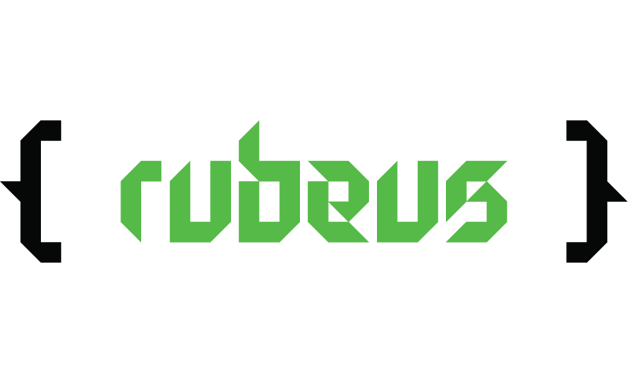

Created by SDSLabs with :heart:

## Contents

* [What is Rubeus?](#what)
* [Why is Rubeus?](#why)
* [How do I use Rubeus?](#setup)
* [How can I contribute?](#how)
* [Remarks](#remarks)

## <a name=what>What is Rubeus?

A cross-platform 2D game engine written in C++17 using OpenGL 3.3. The main objective of making this engine is to provide a simple and fast API to help people realize their game ideas efficiently.

Rubeus uses [broCLI](https://github.com/sdslabs/broCLI), a Go based CLI tool that helps create the project structure for using Rubeus.

Read the [Getting Started guide](https://github.com/sdslabs/Rubeus/wiki) and prefer to use the [API documentation](https://blog.sdslabs.co/Rubeus/) for technical reference on Rubeus code structure.
  

<i>The ping-pong demo game that Rubeus comes with</i>

<i>A custom shader that emulates a light effect over 2D sprites</i>

Rubeus v1.0 is available for use. For using Rubeus for your project, follow the [Getting Started guide](https://github.com/sdslabs/Rubeus/wiki). We also invite you to contribute to this engine along with us. Head [here](CONTRIBUTING.md) to read the contributing guidelines. You can also talk to all the fellow contributors at <a href="https://chat.sdslabs.co">SDSLabs' chat hookup</a>.

## <a name=why>Why is Rubeus?
Rubeus was at first an initiative by SDSLabs to inculcate the spirit of game development amongst the members of this organisation. But after Rubeus achieved a slightly mature state, we realised that it would be best for the development of this project if we get inputs from game engine developers across the open source community, and build this together.

As previously said, we do not expect to have any monetary gains off making this project open-source, nor from any of the games that we might be developing on Rubeus.

Currently Rubeus supports:
* Colour and image textured 2D sprites
* Collision detection and resolution of boxes, circles and planes.
* Cueing music and sound effects with a single line of code. 
* Taking user inputs through mouse and keyboard.
* Easy first look interface for a beginner

More advanced features are scheduled for the next release.

## <a name=setup>How do I use Rubeus?

Rubeus is currently available for use on Windows, Linux ~and Mac build is getting ready~.

#### For making a game:
Follow the [Getting Started guide](https://github.com/sdslabs/Rubeus/wiki).

#### For participating in development of Rubeus:
Setup instructions for Rubeus are explained [here](SETUP.md). Also make sure to read the [contribution guidelines](CONTRIBUTING.md). A good start would be trying to build Rubeus on your personal systems.

## <a name=how>How can I contribute?
Everyone reading this is invited to contribute to Rubeus either through opening issues on Github, making pull requests, adding [Wiki pages](https://github.com/sdslabs/Rubeus/wiki) and talking to the community at [our chat website](https://chat.sdslabs.co). Make sure to read the [contribution guidelines](CONTRIBUTING.md) to ease your way in.

## <a name=remarks>Remarks

* Credits to the owners of helper code:
  * Guerrilla Renderer, the main rendering engine, highly inspired by the [Sparky Engine](https://github.com/TheCherno/Sparky)
  * Awerere Physics collision system, the physics update engine using a homebrewed maths library i.e. Rubeus Maths Library (RML)
  * Symphony Audio Engine, audio effects and cueing engine using SFML as the backend.
  * Easy to use workflow, efforts are being made to release as little information to the user as possible without compromising flexibility.
* v1.0 is available for use.
* v2.0 is a work in production.
